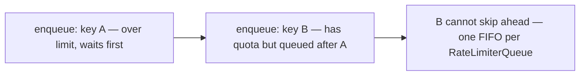

# ratelimit-flex

Flexible, TypeScript-first rate limiting for Node.js with Express, Fastify, NestJS, and Hono.

[](https://www.npmjs.com/package/ratelimit-flex)
[](https://github.com/ashwinpaulallen/ratelimit-flex/blob/main/LICENSE)
[](#security-and-abuse)


## Features

- **Three algorithms:** **Sliding window** (default, smooth & accurate), **Token bucket** (allows bursts), **Fixed window** (simplest, lowest memory) — all fully implemented in both `MemoryStore` and `RedisStore` with atomic Lua scripts
- **Frameworks:** Express and Fastify (separate entry for Fastify to keep bundles lean); NestJS (`ratelimit-flex/nestjs`) and Hono (`ratelimit-flex/hono`)
- **Stores:** `MemoryStore` (in-process), `RedisStore` (shared, Lua-backed for atomic multi-step operations), and `ClusterStore` (Node.js native cluster IPC)
- **Request queuing:** Queue over-limit requests instead of rejecting them immediately (`expressQueuedRateLimiter`, `fastifyQueuedRateLimiter`, `createRateLimiterQueue`)
- **TypeScript-first:** strict types, discriminated options where it matters
- **Redis resilience:** insurance limiter fallback, circuit breaker, counter sync on recovery; or **`fail-open`** / **`fail-closed`** when Redis is unavailable without insurance
- **In-memory block shielding:** `InMemoryShield` / `inMemoryBlock` — cache blocked keys in process memory so hot keys stop hitting Redis under attack
- **Metrics & observability (Express & Fastify):** aggregated snapshots, Prometheus, OpenTelemetry — `metrics: true` ([full docs][doc-metrics])
- **Weighted requests:** `incrementCost` (or `store.increment(..., { cost })`) so expensive endpoints consume more quota than cheap ones
- **Presets:** `singleInstancePreset`, `multiInstancePreset`, `resilientRedisPreset`, `clusterPreset`, `queuedClusterPreset`, `apiGatewayPreset`, `authEndpointPreset`, `publicApiPreset`
- **Limiter composition:** `compose.all()`, `compose.overflow()`, `compose.firstAvailable()`, `compose.race()`, `compose.windows()`, `compose.withBurst()`, nested `ComposedStore`
- **Programmatic key management:** `KeyManager` for blocks, penalties, rewards, events, audit log, and optional admin HTTP API
- **Security:** key cardinality, Redis namespaces, Lua usage, and locking down admin routes

## Table of Contents

- [Installation](#installation)
- [Quick Start](#quick-start)
  - [Express](#quick-start)
  - [Fastify](#quick-start)
- [Framework Integration](#framework-integration)
  - [NestJS](#nestjs)
  - [Hono](#hono)
- [Core Features](#core-features)
  - [In-memory Block Shielding](#in-memory-block-shielding)
  - [Programmatic Key Management](#programmatic-key-management)
  - [Limiter Composition](#limiter-composition)
  - [Request Queuing](#request-queuing)
- [Choosing a Strategy](#choosing-a-strategy)
- [Weighted / Cost-Based Rate Limiting](#weighted--cost-based-rate-limiting)
- [Deployment Guide](#deployment-guide)
  - [When to use MemoryStore](#when-to-use-memorystore)
  - [When to use ClusterStore](#when-to-use-clusterstore)
  - [When to use RedisStore](#when-to-use-redisstore)
- [Presets](#presets)
- [Redis Failure Handling](#redis-failure-handling)
- [Redis Resilience](#redis-resilience)
- [Metrics & Observability](#metrics--observability)
- [Configuration Reference](#configuration-reference)
- [Standard Headers](#standard-headers)
- [Security and Abuse](#security-and-abuse) ⚠️
- [Atomicity & Distributed Systems](#atomicity--distributed-systems)
- [Advanced Features](#advanced-features)
  - [Client IP and Reverse Proxies](#client-ip-and-reverse-proxies)
  - [Multi-window Limits](#multi-window-limits-limits)
- [Custom Stores](#custom-stores)
- [API Reference](#api-reference)
- [Migration Guide](#migration-guide)
- [Contributing](#contributing)
- [License](#license)

## Installation

```bash
npm install ratelimit-flex
```

```bash
yarn add ratelimit-flex
```

```bash
pnpm add ratelimit-flex
```

**Peer dependencies (install only what you use):**

| Package | When you need it |
|---------|------------------|
| `express` (+ `@types/express` for TS) | Express middleware |
| `fastify`, `fastify-plugin` | Fastify plugin (`ratelimit-flex/fastify`) |
| `@nestjs/common`, `@nestjs/core` (+ optional `@nestjs/graphql` for GraphQL context) | NestJS module (`ratelimit-flex/nestjs`) |
| `hono` | Hono middleware (`ratelimit-flex/hono`) |
| `ioredis` | `RedisStore` with `url` (or use your own Redis client adapter) |
| `prom-client` | Optional: `metrics.prometheus.registry` integration |
| `@opentelemetry/api` | Optional: `metrics.openTelemetry.meter` integration |

All peers are optional at install time; the runtime you choose must be present when you import that integration.

**Node.js:** `>= 20` (see `package.json` `engines`).

## Quick Start

**Express (sliding window, the default):**

```ts
import express from 'express';
import rateLimit, { RateLimitStrategy } from 'ratelimit-flex';

const app = express();

// Sliding window (default) - smooth, accurate rate limiting
app.use(rateLimit({ 
  strategy: RateLimitStrategy.SLIDING_WINDOW, // optional, this is the default
  maxRequests: 100, 
  windowMs: 60_000 
}));

// Token bucket - allows bursts
app.use(rateLimit({
  strategy: RateLimitStrategy.TOKEN_BUCKET,
  tokensPerInterval: 20,
  interval: 60_000,
  bucketSize: 60,
}));

// Fixed window - simplest, lowest memory
app.use(rateLimit({
  strategy: RateLimitStrategy.FIXED_WINDOW,
  maxRequests: 100,
  windowMs: 60_000,
}));

app.get('/health', (_req, res) => res.json({ ok: true }));
```

**Fastify (same strategies):**

```ts
import Fastify from 'fastify';
import { fastifyRateLimiter, RateLimitStrategy } from 'ratelimit-flex/fastify';

const app = Fastify();

// Sliding window (default)
await app.register(fastifyRateLimiter, { 
  strategy: RateLimitStrategy.SLIDING_WINDOW,
  maxRequests: 100, 
  windowMs: 60_000 
});

app.get('/health', async () => ({ ok: true }));
```

> ⚠️ **Security Considerations**: Before deploying to production, review [Security and abuse](#security-and-abuse) for guidance on key cardinality, Redis namespaces, and admin API authentication.

## Framework Integration

## NestJS

```typescript
// app.module.ts
import { Controller, Inject, Injectable, Module, Post } from '@nestjs/common';
import { ConfigModule, ConfigService } from '@nestjs/config';
import { KeyManager, RedisStore } from 'ratelimit-flex';
import { RateLimit, RateLimitModule, SkipRateLimit, RATE_LIMIT_KEY_MANAGER } from 'ratelimit-flex/nestjs';

@Module({
  imports: [
    RateLimitModule.forRoot({
      maxRequests: 100,
      windowMs: 60_000,
    }),
  ],
})
export class AppModule {}

// Async config with ConfigService (use in @Module({ imports: [...] }))
@Module({
  imports: [
    RateLimitModule.forRootAsync({
      imports: [ConfigModule],
      inject: [ConfigService],
      useFactory: (config: ConfigService) => ({
        store: new RedisStore({ url: config.get('REDIS_URL')!, /* ... */ }),
        maxRequests: config.get('RATE_LIMIT_MAX'),
      }),
    }),
  ],
})
export class AppModuleAsync {}

// Per-route override
import { RateLimit, SkipRateLimit } from 'ratelimit-flex/nestjs';

@Controller('auth')
export class AuthController {
  @RateLimit({ maxRequests: 5, windowMs: 60_000 })
  @Post('login')
  async login() {
    // ...
  }
}

@SkipRateLimit()
@Controller('health')
export class HealthController {
  // ...
}

// Inject store/keyManager in services
@Injectable()
export class AdminService {
  constructor(@Inject(RATE_LIMIT_KEY_MANAGER) private km: KeyManager) {}
  async blockUser(key: string) {
    await this.km.block(key, 3600_000);
  }
}
```

### NestJS: Per-Route Configuration

`RateLimitGuard` uses the **same** `RateLimitEngine` and backing `store` for the whole app (or feature module). Per-route **`@RateLimit({ ... })`** can override **`maxRequests`**, **`windowMs`**, **`cost`**, and **`keyGenerator`**.

**Per-route strategy:** The module uses one strategy for all routes. To apply different algorithms (e.g. token bucket vs sliding window) to different routes, register multiple `RateLimitModule` instances in separate feature modules with different `strategy` settings.

**Performance note:** The guard caches one `RateLimitEngine` per handler. Prefer static limits in decorators; avoid mutating reflected metadata at runtime.

### NestJS: KeyManager Lifecycle

**Simple rule:** The module destroys KeyManagers it creates. User-supplied KeyManagers are never touched by the module.

- **Auto-created** (from `penaltyBox`): Module calls `keyManager.destroy()` on `onModuleDestroy`
- **User-supplied** (passed via `keyManager` option): You manage the lifecycle — call `destroy()` in your own `OnModuleDestroy` hook
- **Testing**: `await app.close()` handles cleanup for auto-created KeyManagers
- **Non-Nest apps**: Call `keyManager.destroy()` when shutting down

### NestJS: `globalGuard` and module scope

**`globalGuard: true`** (default):
- Registers `APP_GUARD` for automatic rate limiting on all routes
- Makes the module global — `RATE_LIMIT_*` injection tokens available everywhere
- Use `@SkipRateLimit()` decorator to exclude specific controllers/routes

**`globalGuard: false`**:
- Does NOT register `APP_GUARD`
- Module is NOT global — feature modules must `imports: [RateLimitModule]` to access tokens
- Manually apply `@UseGuards(RateLimitGuard)` where needed

> **Upgrading from v2.x?** See [Migration Guide][doc-migration] for breaking changes in v3.0.0.
## Hono

```typescript
import { Hono } from 'hono';
import { rateLimiter } from 'ratelimit-flex/hono';

const app = new Hono();

// Basic usage
const limiter = rateLimiter({
  maxRequests: 100,
  windowMs: 60_000,
  keyGenerator: (c) => c.req.header('x-api-key') ?? 'anon',
});

app.use('*', limiter);

// Per-route
app.post('/login', rateLimiter({ maxRequests: 5, windowMs: 60_000 }), async (c) => {
  return c.json({ ok: true });
});

// With Redis and in-memory shield
import { RedisStore } from 'ratelimit-flex';

const REDIS_URL = process.env.REDIS_URL!;

app.use(
  '*',
  rateLimiter({
    store: new RedisStore({ url: REDIS_URL }),
    maxRequests: 100,
    windowMs: 60_000,
    standardHeaders: 'draft-8',
    inMemoryBlock: true, // Enable DoS protection
  }),
);

// With metrics
const limiterWithMetrics = rateLimiter({
  maxRequests: 100,
  windowMs: 60_000,
  metrics: {
    enabled: true,
    intervalMs: 10_000,
  },
});

app.use('*', limiterWithMetrics);

// Access metrics
app.get('/metrics', (c) => {
  const snapshot = limiterWithMetrics.getMetricsSnapshot();
  return c.json(snapshot);
});

// Cleanup on shutdown
process.on('SIGTERM', async () => {
  await limiterWithMetrics.shutdown();
  process.exit(0);
});

// Queued rate limiter (wait instead of reject)
import { queuedRateLimiter } from 'ratelimit-flex/hono';

app.use(
  '/api/*',
  queuedRateLimiter({
    maxRequests: 10,
    windowMs: 60_000,
    maxQueueSize: 50,
    maxQueueTimeMs: 30_000,
  }),
);

// WebSocket rate limiting
import { webSocketLimiter } from 'ratelimit-flex/hono';
import { upgradeWebSocket } from 'hono/cloudflare-workers';

app.get(
  '/ws',
  webSocketLimiter({
    maxRequests: 10,
    windowMs: 60_000,
    keyGenerator: (c) => c.req.header('x-api-key') ?? 'anon',
  }),
  upgradeWebSocket(() => ({
    onMessage(event, ws) {
      ws.send('pong');
    },
  })),
);
```

### Hono: engine parity

**Same options as Express:** `rateLimiter` accepts the full merged **`RateLimitOptions`** surface — including **`limits`**, **`compose.windows`** / **`ComposedStore`**, **`draft`**, **`groupedWindowStores`**, **`penaltyBox`**, **`keyManager`**, **`onLayerBlock`**, and **`incrementCost`**. Composed layers are available as **`c.get('rateLimitComposed')`** (same idea as Express **`req.rateLimitComposed`**).

**`queuedRateLimiter`:** Uses the **same merge path** as **`rateLimiter`** (full engine options: **`limits`**, composed **`store`**, **`inMemoryBlock`**, **`metrics`**, **`cost`** / **`incrementCost`**, allowlist/blocklist, standard headers, etc.). The returned handler matches **`rateLimiter`** for observability (**`metricsManager`**, **`shield`**, **`keyManager`**, **`openTelemetryAdapter`**, event hooks, **`shutdown`**, …) and adds **`queue`**. It still drives **`RateLimiterQueue`** via **`store.increment`** only — it does **not** run **`RateLimitEngine`**, so engine-only behavior is unavailable: no **`draft`**, no pre-increment **`keyManager`** / **`penaltyBox`** enforcement, and no **`c.get('rateLimitComposed')`**. Same trade-off as Express **`expressQueuedRateLimiter`**.

**`skipFailedRequests` / `skipSuccessfulRequests`:** The middleware **`await`s `next()`** after a successful consume, then uses **`resolvedHonoRollbackStatus`** (exported from **`ratelimit-flex/hono`**) so a missing **`c.res`**, **`0`**, or invalid **`c.res.status`** values are treated as **200** before applying the rollback. Rollbacks use **`resolveIncrementOpts`** / **`matchingDecrementOptions`** for weighted, grouped, and composed stores (same as Express / Fastify).

**Cloudflare Workers:** Pass **`waitUntil: (p) => c.executionCtx.waitUntil(p)`** so post-response **`decrement`** work for skip-response rules is scheduled on the execution context (optional on Node).

**Custom rollback rules:** If you need logic beyond HTTP status (e.g. body shape), add middleware after `rateLimiter` and call **`store.decrement`** with **`resolveIncrementOpts`** / **`matchingDecrementOptions`**; use **`HONO_RATE_LIMIT_INCREMENT_COST`** with the **`cost`** option for weighted quota.

## Core Features

## In-memory block shielding

### Problem statement

Under DoS conditions, every blocked request still hits Redis — 100k req/sec from an attacker means 100k Redis calls/sec **from your own app**. `InMemoryShield` caches blocked keys in local memory so subsequent requests for the same key never touch the store. Result: 7x+ faster under attack, 99%+ fewer store calls.

### Quick start

```typescript
// Option 1: via middleware options (simplest)
app.use(expressRateLimiter({
  store: new RedisStore({ url: REDIS_URL, ... }),
  maxRequests: 100,
  windowMs: 60_000,
  inMemoryBlock: true, // shield kicks in at maxRequests
}));

// Option 2: explicit shield with custom config
import { shield, RedisStore } from 'ratelimit-flex';
const shielded = shield(new RedisStore({ ... }), {
  blockOnConsumed: 100,
  maxBlockedKeys: 10_000,
  onBlock: (key) => console.log(`Shielded: ${key}`),
});
app.use(expressRateLimiter({ store: shielded, maxRequests: 100, windowMs: 60_000 }));
```

### Metrics

```typescript
const metrics = limiter.shield?.getMetrics();
// {
//   blockedKeyCount: 42,        // keys currently blocked in memory
//   storeCallsSaved: 98721,     // total store calls avoided
//   totalKeysBlocked: 150,      // total keys blocked since startup
//   totalKeysExpired: 80,       // keys removed due to window expiry
//   totalKeysEvicted: 28,       // keys removed due to LRU eviction
//   hitRate: 0.993,             // cache hit rate
//   storeCalls: 684             // actual store calls made
// }
```

**`MetricsManager` and periodic snapshots:** When metrics are enabled, middleware passes the **same** `InMemoryShield` instance used as the engine `store` into `MetricsManager`. Each `onMetrics` snapshot may include **`shield`** — that object is `shield.getMetrics()` for **that** instance (blocked-key counts, hit rate, store calls avoided, etc.). Request, block, and latency totals still describe traffic through the engine, which calls `increment` on the outer `store`. If you pass an `InMemoryShield` as `store` **and** set `inMemoryBlock: true`, a second shield wraps the first; **`snapshot.shield` reflects the outer layer only**, and in non-production a **one-time** `console.warn` flags possible double-shielding (intentional stacking is supported).

### How it works

Each request first checks an in-memory map for the key: if the key is still “shielded” (blocked and not yet expired), the limiter returns the cached blocked result in about **~0.01ms** — no Redis round-trip. If there is no entry, or it expired, the request takes the slow path: **`increment()` on the backing store** (typically **~2–5ms** for Redis, depending on network and load). When the store shows the key has consumed enough quota, the shield records that state locally and keeps serving blocked responses from RAM until the block window expires or you invalidate the entry (for example via `KeyManager`).

`InMemoryShield` implements **`RateLimitStore`**: wrap Redis, a composed store, or any custom implementation; use it with **`compose.*`** and multi-layer setups; expose shield metrics alongside Prometheus/OpenTelemetry; opt into **`onBlock`**, **`onExpire`**, and **`onShieldHit`** callbacks; and wire **`KeyManager`** so reward, unblock, and delete operations clear stale shield entries.

## Programmatic key management

ratelimit-flex exposes a `KeyManager` for programmatic control of rate limit keys. Block abusive clients, apply penalty/reward points, inspect state, and react to events — all with full TypeScript types, an audit trail, and optional Redis persistence.

### Basic usage

```typescript
import express from 'express';
import { KeyManager, MemoryStore, RateLimitStrategy, expressRateLimiter } from 'ratelimit-flex';

const app = express();
const store = new MemoryStore({ strategy: RateLimitStrategy.SLIDING_WINDOW, windowMs: 60_000, maxRequests: 100 });
const keyManager = new KeyManager({ store, maxRequests: 100, windowMs: 60_000 });

const limiter = expressRateLimiter({ store, keyManager });
app.use(limiter);

// Programmatic control — from an admin route, webhook handler, etc.
await keyManager.block('abusive-ip', 3600_000, { type: 'manual', message: 'Spam detected' });
await keyManager.penalty('suspicious-user', 5);
await keyManager.reward('verified-user', 10);
const state = await keyManager.get('any-key');
```

### Escalating penalties

```typescript
import { KeyManager, exponentialEscalation } from 'ratelimit-flex';

const keyManager = new KeyManager({
  store,
  maxRequests: 100,
  windowMs: 60_000,
  penaltyBlockThreshold: 3,
  penaltyEscalation: exponentialEscalation(60_000), // 1min, 2min, 4min, 8min...
});
```

### Event-driven alerting

```typescript
keyManager.on('blocked', ({ key, reason }) => {
  alerting.send(`Key ${key} blocked: ${reason.type}`);
});
```

### Admin endpoints

```typescript
import { createAdminRouter } from 'ratelimit-flex';

app.use('/admin/ratelimit', authMiddleware, createAdminRouter(keyManager));
// GET /admin/ratelimit/keys/:key
// POST /admin/ratelimit/keys/:key/block
// etc.
```

### What `KeyManager` provides

`KeyManager` gives you typed **block reasons** (`manual`, `penalty-escalation`, `abuse-pattern`, `custom`), an **event emitter** (`blocked`, `unblocked`, `penalized`, `rewarded`, and more), an **audit log** with filtering, **escalation strategies** for automatic penalty blocks, optional **admin REST endpoints** (`createAdminRouter`, `fastifyAdminPlugin`), and optional **Redis-backed block persistence** (`RedisBlockStore`) so block state can be shared across processes.

### Redis-backed block persistence

Share block state across processes using `RedisBlockStore`:

```typescript
import { KeyManager, RedisBlockStore, RedisStore, RateLimitStrategy } from 'ratelimit-flex';
import Redis from 'ioredis';

// Create a single Redis client instance
const redis = new Redis(process.env.REDIS_URL!);

// Share the client between RedisStore (for rate limit counters) and RedisBlockStore (for blocks)
const store = new RedisStore({
  client: redis,
  strategy: RateLimitStrategy.SLIDING_WINDOW,
  windowMs: 60_000,
  maxRequests: 100,
});

const blockStore = new RedisBlockStore(redis, { keyPrefix: 'rlf:blocks:' });

const keyManager = new KeyManager({
  store,
  blockStore,
  maxRequests: 100,
  windowMs: 60_000,
  syncIntervalMs: 5000, // Pull remote blocks every 5 seconds
});

// Blocks are now persisted to Redis and visible across all processes
await keyManager.block('abusive-ip', 3600_000, { type: 'manual', message: 'Spam' });
```

**Cross-process consistency:** `KeyManager` syncs blocks from Redis every `syncIntervalMs` (default 5000ms). Call `await keyManager.syncBlocks()` manually for immediate consistency.

### Migrating from `penaltyBox`

**Why you cannot set `penaltyBox` and `keyManager` together:** `mergeRateLimiterOptions` throws if both appear in the same options object. `penaltyBox` uses the engine’s built-in violation counter and `penaltyUntil` map. A **user-supplied** `KeyManager` adds a separate blocking and penalty-point system (`penalty()`, escalation, audit). Allowing both would pit two policies against each other for the same keys.

**Option A — keep `penaltyBox`:** If you only need “**N** real rate-limit blocks within **`violationWindowMs`**, then ban for **`penaltyDurationMs`**, keep `penaltyBox` and **do not** pass your own `keyManager`. (Frameworks may still synthesize an internal `KeyManager` for Nest lifecycle or related wiring when you only use `penaltyBox`; that is not the same as configuring both options yourself.)

**Option B — migrate to an explicit `KeyManager`:** Drop `penaltyBox` and drive bans through `KeyManager`. Map fields roughly like this:

| `penaltyBox` | `KeyManager` |
|--------------|----------------|
| `violationsThreshold` | `penaltyBlockThreshold` (penalty points before an automatic block) |
| `penaltyDurationMs` | `penaltyBlockDurationMs` (base duration), or replace with `penaltyEscalation` for longer blocks on repeat offenses |
| `onPenalty` | `keyManager.on('blocked', …)` (and/or audit entries) |

The engine **does not** call `keyManager.penalty()` when a request hits the rate limit — you wire that yourself, typically from **`onLimitReached`**, so each limit hit adds a penalty point toward the threshold:

**Before (`penaltyBox`):**

```typescript
app.use(
  expressRateLimiter({
    store,
    maxRequests: 100,
    windowMs: 60_000,
    penaltyBox: {
      violationsThreshold: 3,
      violationWindowMs: 3_600_000,
      penaltyDurationMs: 60_000,
    },
  }),
);
```

**After (`KeyManager` + `onLimitReached` + escalation):**

```typescript
import { expressRateLimiter, KeyManager, exponentialEscalation } from 'ratelimit-flex';

const keyGenerator = (req: import('express').Request) =>
  /* same key you use for rate limiting, e.g. forwarded IP */ String(req.ip ?? '');

const keyManager = new KeyManager({
  store,
  maxRequests: 100,
  windowMs: 60_000,
  penaltyBlockThreshold: 3,
  penaltyEscalation: exponentialEscalation(60_000), // 1m, 2m, 4m, … after each threshold breach
});

app.use(
  expressRateLimiter({
    store,
    maxRequests: 100,
    windowMs: 60_000,
    keyGenerator,
    keyManager,
    onLimitReached: async (req) => {
      await keyManager.penalty(keyGenerator(req), 1);
    },
  }),
);

keyManager.on('blocked', ({ key, reason }) => {
  console.log(`Blocked: ${key}`, reason);
});
```

**Semantics note:** `penaltyBox` counts blocks in a sliding **`violationWindowMs`** (default one hour). `KeyManager` penalty points are tracked in an adjustment window tied to the limiter’s **`windowMs`**, not to `violationWindowMs`. If your old config relied on a **long** violation window and a **short** rate-limit window, either keep `penaltyBox` or add your own sliding-window counting before calling `penalty()`.

**Benefits of Option B:**
- Typed block reasons (`manual`, `penalty-escalation`, `abuse-pattern`, `custom`)
- Event system for real-time alerting
- Audit log with filtering
- Escalation strategies (exponential, fibonacci, etc.)
- Admin HTTP endpoints
- Redis-backed block persistence

## Security and abuse

### Key cardinality and `keyGenerator`

Rate limit **state** (memory stores, `InMemoryShield` block maps, `KeyManager` bookkeeping, Redis keys, etc.) grows with **distinct** storage keys. A `keyGenerator` that returns a **new high-cardinality value per request** (full URL including unbounded query strings, raw JWTs, unbounded device fingerprints) lets attackers inflate memory or Redis usage.

**Mitigations:** Prefer **stable, low-cardinality** identifiers (user id, tenant id, API key id). **Normalize or hash** untrusted inputs before using them as keys. The library does **not** cap key string length—enforce a maximum or digest in your **`keyGenerator`** if inputs are user-controlled. Use **`InMemoryShieldOptions.maxBlockedKeys`** and related limits where applicable.

### Redis namespace (`keyPrefix`)

`RedisStore` (and **`RedisBlockStore`**) prefix all logical keys. Use a **different** `keyPrefix` (and/or Redis **DB index**) per **application** or **tenant** when multiple services share one Redis so counters and blocks do not **collide**. Document the convention for your org.

### Lua scripts (`RedisStore`)

All Lua in `RedisStore` is **static source** in the package. Quota and key data are passed only as **`KEYS`** / **`ARGV`** to **`EVAL`**—never build Lua by concatenating user input into the script body.

### Key Manager admin HTTP API

**`createAdminRouter`** (Express) and **`createFastifyAdminPlugin`** expose full control over rate limit and block state. In **production**, mount them **only** behind **authentication**, **authorization**, and ideally **network isolation** (VPN, admin-only ingress). The JSDoc on those factories repeats this warning—treat it as mandatory for exposed deployments.

## Atomicity & Distributed Systems

### Redis operations are atomic

**All `RedisStore` operations use Lua scripts for atomicity.** Each rate limit check executes as a single atomic operation on the Redis server—no race conditions, no requests slipping through under concurrent load from multiple processes or nodes.

**What this means:**

- **Sliding window:** `ZREMRANGEBYSCORE` (prune expired) + `ZADD` (add entries) + `ZCARD` (count) + `PEXPIRE` — all in one `EVAL`
- **Fixed window:** `INCRBY` + conditional `PEXPIRE` + `PTTL` — all in one `EVAL`
- **Token bucket:** `HGET` (read state) + refill calculation + token deduction + `HSET` (write) + `PEXPIRE` — all in one `EVAL`

**No interleaving:** Other Redis clients cannot execute commands between the steps of a rate limit operation. The entire check-and-increment logic runs atomically.

**Why Lua?** Redis `EVAL` executes Lua scripts as atomic blocks. While a script runs, Redis does not process other commands from other clients. This guarantees that:

1. **Concurrent requests** from multiple app instances cannot race
2. **Distributed systems** get consistent, accurate rate limiting
3. **Multi-step operations** (read → calculate → write) are safe

**Script caching:** Most Redis clients (including `ioredis` and `node-redis`) automatically cache Lua scripts server-side after the first execution using `EVALSHA`. Subsequent calls reuse the cached script, reducing network overhead. The library passes the full script source on every call; the client handles optimization transparently.

**MemoryStore & ClusterStore:** In-process stores use JavaScript synchronous operations (no atomicity concerns within a single event loop). `ClusterStore` uses IPC message passing with acknowledgments to coordinate across Node.js cluster workers.

### Distributed deployment considerations

When running multiple app instances with `RedisStore`:

- **Shared state:** All instances see the same counters in Redis
- **Consistent limits:** A user hitting 100 req/min is enforced globally, not per instance
- **No coordination needed:** Each instance independently calls Redis; Lua atomicity handles races
- **Network latency:** Redis round-trip adds ~1-5ms per request (use `InMemoryShield` to cache blocked keys and eliminate Redis calls for hot attackers)

**Cluster vs Redis:**

- **`ClusterStore`:** Coordinates rate limits across Node.js `cluster` workers in a **single machine** (IPC, no network)
- **`RedisStore`:** Coordinates across **multiple machines/containers/regions** (network, shared Redis)

For multi-instance deployments (Kubernetes, serverless, multiple VMs), use **`RedisStore`**. For single-machine concurrency (one server, multiple CPU cores), use **`ClusterStore`**.

## Limiter composition

Combine multiple rate limiters with the `compose` builder. Every composition mode implements `RateLimitStore`, so composed stores plug directly into `expressRateLimiter` / `fastifyRateLimiter`.

### Composition Modes

| Mode | Behavior | Use case |
|------|----------|----------|
| **`all`** | Block if **any** layer blocks | Multi-window limiting (10/sec AND 100/min) |
| **`overflow`** | Try primary first; if blocked, try burst pool | Steady rate + burst allowance |
| **`first-available`** | Try layers in order; first that allows wins | Failover chain (Redis → memory) |
| **`race`** | Fire all layers in parallel; fastest wins | Multi-region latency optimization |

### Quick Examples

**Multi-window** (10/sec AND 100/min):
```typescript
import { compose, expressRateLimiter } from 'ratelimit-flex';

const store = compose.windows(
  { windowMs: 1_000, maxRequests: 10 },
  { windowMs: 60_000, maxRequests: 100 },
);

app.use(expressRateLimiter({ store }));
```

**Burst allowance** (steady + burst):
```typescript
const store = compose.withBurst({
  steady: { windowMs: 1_000, maxRequests: 5 },
  burst:  { windowMs: 60_000, maxRequests: 20 },
});

app.use(expressRateLimiter({ store }));
```

**Failover chain** (Redis → memory):
```typescript
const store = compose.firstAvailable(
  compose.layer('redis', redisStore),
  compose.layer('memory', memoryStore),
);

app.use(expressRateLimiter({ store }));
```

**Full documentation:** See [docs/COMPOSITION.md][doc-composition] for:
- Nested composition patterns
- Per-layer observability
- Redis composition presets
- Migration from `limits` array

## Request queuing

**Source of truth:** Full FIFO semantics, head-of-line blocking, and multi-key patterns are documented in JSDoc on [`src/queue/RateLimiterQueue.ts`](src/queue/RateLimiterQueue.ts) (`RateLimiterQueueOptions`, `RateLimiterQueue`). That file is the canonical explanation; this section summarizes it for README readers.

**Typical use case:** Outbound API throttling (one queue per external API, single key for all requests).

**Head-of-line blocking (by design):** The queue is one **FIFO** array. If you share that queue across **different** keys, a waiting request for key **A** sits in front of a request for key **B** — even when **B** still has rate-limit capacity — because release order follows **enqueue** order, not per-key fairness.



## Request queuing

Queue over-limit requests instead of rejecting them immediately. Requests wait in a FIFO queue and are released when quota becomes available.

### Quick Start

**Express:**
```typescript
import { expressQueuedRateLimiter } from 'ratelimit-flex';

app.use('/api', expressQueuedRateLimiter({
  maxRequests: 5,
  windowMs: 10_000,
  maxQueueSize: 50,
  maxQueueTimeMs: 30_000,
}));
```

**Fastify:**
```typescript
import { fastifyQueuedRateLimiter } from 'ratelimit-flex/fastify';

await app.register(fastifyQueuedRateLimiter, {
  maxRequests: 5,
  windowMs: 10_000,
  maxQueueSize: 50,
  maxQueueTimeMs: 30_000,
});
```

**Outbound API throttling:**
```typescript
import { createRateLimiterQueue } from 'ratelimit-flex';

const githubQueue = createRateLimiterQueue({
  maxRequests: 30,
  windowMs: 60_000,
  maxQueueSize: 200,
});

await githubQueue.removeTokens('github-api');
const response = await fetch('https://api.github.com/repos/...');
```

### Important: Head-of-Line Blocking

The queue is one **FIFO** array. If you share that queue across **different** keys, a waiting request for key **A** blocks requests for key **B** — even when **B** has capacity.

**Solution:** Use one queue per key, or use `KeyedRateLimiterQueue` for automatic per-key queues with LRU eviction.

**Full documentation:** See [docs/QUEUING.md][doc-queuing] for:
- Multi-key patterns
- Graceful shutdown
- Store ownership
- Advanced patterns (per-tenant, priority queuing)

**Implementation:**
- **Redis:** `ZSET` with `ZREMRANGEBYSCORE` + `ZADD` + `ZCARD` in atomic Lua
- **Memory:** Sorted array of timestamps per key
- **Boundary behavior:** Smooth - no 2x burst at window edges

```ts
import { expressRateLimiter, RateLimitStrategy } from 'ratelimit-flex';

app.use(
  expressRateLimiter({
    strategy: RateLimitStrategy.SLIDING_WINDOW, // default
    windowMs: 60_000,
    maxRequests: 100,
  }),
);
```

### Token bucket (for bursty traffic)

Refills tokens on a schedule; clients can **burst** up to `bucketSize`. Best for spiky traffic (mobile apps, retries, webhooks).

**Implementation:**
- **Redis:** `HASH` with atomic refill calculation + token deduction in Lua
- **Memory:** Stores `{ tokens, lastRefill }` per key
- **Burst control:** Allows bursts when bucket is full

```ts
import { expressRateLimiter, RateLimitStrategy } from 'ratelimit-flex';

app.use(
  expressRateLimiter({
    strategy: RateLimitStrategy.TOKEN_BUCKET,
    tokensPerInterval: 20,  // Add 20 tokens per minute
    interval: 60_000,       // Every 60 seconds
    bucketSize: 60,         // Max 60 tokens (allows 3x burst)
  }),
);
```

### Fixed window (simplest)

One counter per fixed time slice. Simplest and lowest memory; acceptable when occasional boundary spikes are OK.

**Implementation:**
- **Redis:** `INCRBY` + `PEXPIRE` in atomic Lua script
- **Memory:** Single counter per key
- **Warning:** Users can burst 2x limit at boundaries (50 at 11:59:59, 50 at 12:00:00)

```ts
import { expressRateLimiter, RateLimitStrategy } from 'ratelimit-flex';

app.use(
  expressRateLimiter({
    strategy: RateLimitStrategy.FIXED_WINDOW,
    windowMs: 60_000,
    maxRequests: 100,
  }),
);
```


## Performance Benchmarks

Benchmarks measured on Apple M1 Pro, Node.js v20, using isolated test harness. Your results may vary based on hardware, network latency (Redis), and load patterns.

### Throughput (requests/second)

| Store | Strategy | Throughput | Notes |
|-------|----------|------------|-------|
| MemoryStore | Sliding Window | ~450,000 | Single process, in-memory only |
| MemoryStore | Fixed Window | ~750,000 | Lowest overhead |
| MemoryStore | Token Bucket | ~550,000 | Refill calculation overhead |
| RedisStore | Sliding Window | ~35,000 | Network-bound, local Redis |
| RedisStore | Fixed Window | ~45,000 | Simpler Lua script |
| InMemoryShield (hit) | — | ~1,800,000 | Blocked keys cached in memory |
| InMemoryShield (miss) | — | ~35,000 | Falls through to Redis |

### Latency Overhead (p50 / p95 / p99)

| Store | p50 | p95 | p99 | Notes |
|-------|-----|-----|-----|-------|
| MemoryStore | 0.05ms | 0.12ms | 0.25ms | Pure JavaScript, no I/O |
| RedisStore (local) | 1.8ms | 4.2ms | 8.5ms | Includes network + Lua execution |
| RedisStore (remote) | 5-15ms | 15-30ms | 30-50ms | Depends on network latency |
| InMemoryShield (hit) | 0.01ms | 0.03ms | 0.06ms | Hash map lookup only |
| InMemoryShield (miss) | 1.8ms | 4.2ms | 8.5ms | Same as RedisStore |

### Memory Usage (per 10k keys)

| Store | Strategy | Memory | Notes |
|-------|----------|--------|-------|
| MemoryStore | Sliding Window | ~2.5 MB | Stores timestamps per hit |
| MemoryStore | Fixed Window | ~0.8 MB | Single counter per key |
| MemoryStore | Token Bucket | ~1.2 MB | Stores tokens + lastRefill |
| InMemoryShield | — | ~1.5 MB | Blocked keys + expiry times |

### Scalability

**Single process (MemoryStore):**
- Linear scaling with CPU cores (use Node.js cluster or ClusterStore)
- No network overhead
- Memory grows with unique keys

**Multi-process (RedisStore):**
- Horizontal scaling across machines
- Network latency adds ~1-5ms per request (local Redis)
- Shared state across all instances

**InMemoryShield + Redis:**
- Best of both: shared state + local caching for hot keys
- 7x faster for blocked keys under attack
- 99%+ reduction in Redis calls for repeat offenders

### Benchmark Methodology

Benchmarks use:
- Isolated test harness with controlled load
- Single key (worst case for contention)
- Mixed read/write patterns
- Local Redis (Docker) for network tests
- No other services running

**Run benchmarks yourself:**
```bash
git clone https://github.com/yourusername/ratelimit-flex
cd ratelimit-flex
npm install
npm run benchmark
```

> **Note:** These are micro-benchmarks. Real-world performance depends on your application's request patterns, key cardinality, network topology, and Redis configuration.

## Weighted / cost-based rate limiting

By default each request consumes **one** quota unit. For endpoints that should count more (file uploads, heavy database work, high GraphQL complexity), use a **cost** greater than `1`.

**Middleware / engine** — set **`incrementCost`** on the rate limiter options (number or function of the request):

```ts
import { expressRateLimiter } from 'ratelimit-flex';

app.use(
  expressRateLimiter({
    maxRequests: 100,
    windowMs: 60_000,
    incrementCost: (req) =>
      String((req as import('express').Request).path ?? '').startsWith('/upload') ? 10 : 1,
  }),
);
```

**Custom pipelines** — call the store directly with **`increment`** / **`decrement`** options:

```ts
await store.increment(key, { cost: 10 });
// … later, undo the same weight (e.g. custom skip logic):
await store.decrement(key, { cost: 10 });
```

Dynamic caps plus cost still work together: **`increment`** accepts **`{ maxRequests?, cost? }`** on window strategies.

Helpers **`resolveIncrementOpts(options, req)`** and **`matchingDecrementOptions(incOpts)`** are exported if you build your own middleware and need the same increment/decrement pairing as the built-in engine.

**Redis implementation note:** for sliding windows with **`cost > 1`**, each ZSET member is a distinct random value so Redis never silently merges two hits into one.

## Deployment guide

### When to use MemoryStore

Use **MemoryStore** when:

- One Node process serves all traffic (no horizontal scale)
- Local development and prototyping
- Automated tests
- Small deployments with a single instance

Counters live **only in that process**. No Redis required.

```ts
import { expressRateLimiter, MemoryStore, RateLimitStrategy } from 'ratelimit-flex';

const store = new MemoryStore({
  strategy: RateLimitStrategy.SLIDING_WINDOW,
  windowMs: 60_000,
  maxRequests: 100,
});

app.use(expressRateLimiter({ store, windowMs: 60_000, maxRequests: 100 }));
```

If you omit `store`, the middleware creates a `MemoryStore` from `windowMs` / `maxRequests` (or token-bucket fields).

### When to use ClusterStore

Use **ClusterStore** when:

- Node.js native **`cluster`** module (not PM2)
- No Redis available or desired
- Single server with multiple CPU cores

```ts
// primary.ts (ESM — top-level await)
import cluster from 'node:cluster';
import { ClusterStorePrimary } from 'ratelimit-flex';

if (cluster.isPrimary) {
  ClusterStorePrimary.init();
  for (let i = 0; i < 4; i++) cluster.fork();
} else {
  await import('./app.js');
}
```

```ts
// app.ts (worker)
import express from 'express';
import { expressRateLimiter, clusterPreset } from 'ratelimit-flex';

const app = express();
app.use(expressRateLimiter(clusterPreset({ maxRequests: 100, windowMs: 60_000 })));
```

**IPC protocol version:** Worker `init` and primary `init_ack` carry **`protocolVersion`** (constants **`CLUSTER_IPC_PROTOCOL_VERSION`** and **`MIN_CLUSTER_IPC_PROTOCOL_VERSION`** in [`src/cluster/protocol.ts`](src/cluster/protocol.ts)). During rolling deploys, if a worker’s version is **newer** than the primary, the primary responds with **`init_nack`** so the process fails fast instead of corrupting counters. Legacy peers that omit **`protocolVersion`** are treated as **version 1**.

### When to use RedisStore

Use **RedisStore** when:

- Multiple Node processes (e.g. PM2 cluster)
- Multiple servers behind a load balancer
- Kubernetes, Docker Swarm, or similar
- Microservices where the same client can hit **different** instances
- You need one global limit across replicas

```ts
import { expressRateLimiter, RedisStore, RateLimitStrategy } from 'ratelimit-flex';

const store = new RedisStore({
  strategy: RateLimitStrategy.SLIDING_WINDOW,
  windowMs: 60_000,
  maxRequests: 100,
  url: process.env.REDIS_URL!,
});

app.use(expressRateLimiter({ store, strategy: RateLimitStrategy.SLIDING_WINDOW }));
```

Prefer passing a **shared Redis URL or client** from every instance. Use a **distinct key prefix** (`keyPrefix`) per app or per limiter if several services share one Redis.

**Clients and adapters:** The default **`url`** path uses optional peer **`ioredis`**. For **`@redis/client`** (node-redis), **`adaptNodeRedisClient`**; for **ioredis**, **`adaptIoRedisClient`**—see **`RedisLikeClient`** in the API reference. **Bun** and **Upstash** need thin wrappers (Lua **`EVAL`** required); copy-paste starters live in **[`examples/redis/README.md`](examples/redis/README.md)** (not published packages—maintain locally).

**Lua `EVAL`, `EVALSHA`, and connections:** **`RedisStore`** always invokes **`eval(fullScript, …)`** on your client. It does **not** embed **`EVALSHA`**. Clients often optimize repeated **`EVAL`** into **`EVALSHA`** after Redis caches the script. **Reuse one long-lived client per process** (or warm serverless instance) where possible—per-request connections add latency and can reduce script-cache hits on the Redis side.

**Multi-window:** The convenience **`limits: [{ windowMs, max }, …]`** option (see [Multi-window limits (`limits`)](#multi-window-limits-limits)) creates one **`MemoryStore` per window**. It does **not** switch those slots to Redis automatically. For the same multi-window policy across horizontally scaled processes, build **`groupedWindowStores`** with one **`RedisStore`** (or other shared `RateLimitStore`) per slot.

### Deployment topology

| Setup | Store | What’s shared | What’s per-process |
|-------|--------|----------------|---------------------|
| Single process | `MemoryStore` | Everything (one process) | N/A |
| Node.js native `cluster` (same host, forked workers) | `ClusterStore` + `ClusterStorePrimary` | Rate limit counters (on primary) | Allowlist, blocklist, penalty |
| PM2 cluster (same host) | `RedisStore` | Rate limit counters | Allowlist, blocklist, penalty |
| Multiple servers + LB | `RedisStore` | Rate limit counters | Allowlist, blocklist, penalty |
| Kubernetes pods | `RedisStore` | Rate limit counters | Allowlist, blocklist, penalty |
| Microservices (one global limit) | `RedisStore` (same namespace/prefix) | Rate limit counters | Allowlist, blocklist, penalty |
| Microservices (per-service limits) | `RedisStore` (different prefix/DB) | Per-service counters | Allowlist, blocklist, penalty |

**PM2 vs Node `cluster`:** **`ClusterStore`** (Node’s native `cluster` IPC with **`ClusterStorePrimary`** on the primary) is **not** for PM2 cluster mode. PM2 runs independent worker processes and uses its own IPC to the daemon, not a Node `cluster` primary/worker tree. For PM2, use **`RedisStore`** (or another shared store). At startup, **`ClusterStore`** detects PM2 (`PM2_HOME` or `pm_id`) and throws a clear error if the process is not a Node cluster worker.

**Sticky sessions:** If your load balancer uses sticky sessions, `MemoryStore` can appear to work, but it is fragile—deploys and restarts reset counters per instance. **`RedisStore` survives restarts** and stays consistent across nodes.

### Auto-detection and warnings

**`detectEnvironment()`** returns flags such as `isKubernetes`, `isDocker`, `isCluster`, `isMultiInstance`, and a **`recommended`** store (`'memory'` | `'redis'`). Use it in your own startup logging or configuration.

```ts
import { detectEnvironment } from 'ratelimit-flex';

const env = detectEnvironment();
if (env.recommended === 'redis' && !process.env.REDIS_URL) {
  console.warn('Production-like environment detected; consider Redis for shared limits.');
}
```

Express and Fastify integrations also call **`warnIfMemoryStoreInCluster`** once at startup: if a **MemoryStore** is used and the process looks like a **multi-instance** environment (e.g. Docker, Kubernetes, PM2), a **one-time** stderr warning is printed.

Suppress with:

```bash
RATELIMIT_FLEX_NO_MEMORY_WARN=1
```

Similarly, if **`RedisStore`** is used **without** an insurance limiter (`resilience.insuranceLimiter`) in a multi-instance-looking environment, a **one-time** stderr reminder suggests **`resilientRedisPreset`** or configuring insurance for failover protection.

Suppress with:

```bash
RATELIMIT_FLEX_NO_RESILIENCE_WARN=1
```

## Presets

Presets return a **`Partial<RateLimitOptions>`** you can pass to `expressRateLimiter` / `fastifyRateLimiter` (or spread and override).

### `singleInstancePreset(options?)`

**When:** Dev, tests, single-process apps.

- Sliding window, **100 req / min** (defaults), in-memory (no `store` in preset—middleware builds `MemoryStore`).

```ts
import { expressRateLimiter, singleInstancePreset } from 'ratelimit-flex';

app.use(expressRateLimiter(singleInstancePreset({ maxRequests: 200 })));
```

### `multiInstancePreset(redisOptions, options?)`

**When:** Production with Redis, multiple workers or nodes.

- `RedisStore`, sliding window, **100 req / min**
- **`onRedisError`:** `fail-open` by default (override via `redisOptions.onRedisError`)

```ts
import { expressRateLimiter, multiInstancePreset } from 'ratelimit-flex';

app.use(
  expressRateLimiter(
    multiInstancePreset({ url: process.env.REDIS_URL! }, { maxRequests: 500 }),
  ),
);
```

### `resilientRedisPreset(redisOptions, options?)`

**When:** Production **Redis** with **insurance** (in-memory fallback), **circuit breaker**, optional **counter sync** on recovery, and per-worker limit scaling. See [Redis resilience](#redis-resilience) for behavior, examples, and comparison with fail-open / fail-closed.

### `clusterPreset(options?)`

**When:** Node.js native `cluster` module (not PM2), single server with multiple CPU cores, no Redis.

- `ClusterStore`, sliding window, **100 req / min**
- Requires `ClusterStorePrimary.init()` on the primary process

```ts
// primary.ts
import cluster from 'node:cluster';
import { ClusterStorePrimary } from 'ratelimit-flex/cluster';

if (cluster.isPrimary) {
  ClusterStorePrimary.init();
  for (let i = 0; i < 4; i++) cluster.fork();
} else {
  await import('./app.js');
}
```

```ts
// app.ts (worker)
import { expressRateLimiter, clusterPreset } from 'ratelimit-flex';

app.use(expressRateLimiter(clusterPreset({ maxRequests: 100, windowMs: 60_000 })));
```

### `queuedClusterPreset(options?)`

**When:** Node.js native `cluster` + **request queuing** (queue over-limit requests instead of rejecting them).

- `ClusterStore` + `expressQueuedRateLimiter` / `fastifyQueuedRateLimiter`
- Sliding window, **100 req / min**, **queue size 100**, **30s max wait**
- Requires `ClusterStorePrimary.init()` on the primary process

```ts
// primary.ts
import cluster from 'node:cluster';
import { ClusterStorePrimary } from 'ratelimit-flex/cluster';

if (cluster.isPrimary) {
  ClusterStorePrimary.init();
  for (let i = 0; i < 4; i++) cluster.fork();
} else {
  await import('./app.js');
}
```

```ts
// app.ts (worker)
import { expressQueuedRateLimiter, queuedClusterPreset } from 'ratelimit-flex';

app.use('/api', expressQueuedRateLimiter(queuedClusterPreset({
  maxRequests: 50,
  windowMs: 60_000,
  maxQueueSize: 200,
})));
```

### `apiGatewayPreset(redisOptions, options?)`

**When:** API gateway–style traffic, key per client credential.

- Token bucket (~**30** tokens/min, **burst 60**), **`x-api-key`** key generator
- **`fail-closed`** when Redis is down (override possible)

```ts
import { expressRateLimiter, apiGatewayPreset } from 'ratelimit-flex';

app.use('/v1', expressRateLimiter(apiGatewayPreset({ url: process.env.REDIS_URL! })));
```

### `authEndpointPreset(redisOptions, options?)`

**When:** Login, signup, password reset—brute-force protection.

- **Fixed window**, **5 req / min** per IP (default), IP-based key
- **`fail-closed`** when Redis is down

```ts
import { expressRateLimiter, authEndpointPreset } from 'ratelimit-flex';

app.post(
  '/login',
  expressRateLimiter(authEndpointPreset({ url: process.env.REDIS_URL! }, { maxRequests: 10 })),
  loginHandler,
);
```

### `publicApiPreset(options?)`

**When:** Public HTTP APIs with a simple in-memory limit and structured JSON errors.

- Sliding window, **60 req / min**, default `message` object

```ts
import { expressRateLimiter, publicApiPreset } from 'ratelimit-flex';

app.use('/public', expressRateLimiter(publicApiPreset()));
```

## Redis failure handling

| Mode | Behavior if Redis errors during quota check |
|------|-----------------------------------------------|
| **`fail-open`** (default for `RedisStore`) | Request is **allowed**; warning logged |
| **`fail-closed`** | Request is treated as **blocked**; middleware responds **503** with `{ error: 'Service temporarily unavailable' }` |

**Recommendation:** **`fail-open`** for most general APIs (availability over strict quota). **`fail-closed`** for auth, payments, or when you must not serve traffic without a working limiter.

```ts
// Fail-open (default)
new RedisStore({ url: REDIS_URL, strategy: RateLimitStrategy.SLIDING_WINDOW, windowMs: 60_000, maxRequests: 100 });

// Fail-closed
new RedisStore({
  url: REDIS_URL,
  strategy: RateLimitStrategy.SLIDING_WINDOW,
  windowMs: 60_000,
  maxRequests: 100,
  onRedisError: 'fail-closed',
});
```

**Policy vs counters:** **Allowlist**, **blocklist**, and **penalty box** are enforced in the **RateLimitEngine** (in-memory) **before** the store runs. They **still apply** when Redis is down. Only **quota / window / bucket** counting depends on `RedisStore.increment`.

## Redis resilience

When Redis is unavailable, the default **`fail-open`** / **`fail-closed`** modes either allow every request or block every request globally—there is no per-client quota during the outage. An **insurance limiter** fixes that: a dedicated **`MemoryStore`** that activates automatically when the circuit breaker decides Redis is unhealthy, so each process still enforces **per-process** limits. Configure that in-memory cap as roughly **total shared limit ÷ expected worker count** (e.g. 300 requests/minute across 5 replicas → **60** per process) so failover traffic stays in the same ballpark as your global Redis budget.

### Manual setup (`RedisStore` + `resilience`)

```typescript
import { expressRateLimiter, RedisStore, MemoryStore, RateLimitStrategy } from 'ratelimit-flex';

const insuranceStore = new MemoryStore({
  strategy: RateLimitStrategy.SLIDING_WINDOW,
  windowMs: 60_000,
  maxRequests: 60, // 300 / 5 workers
});

const store = new RedisStore({
  strategy: RateLimitStrategy.SLIDING_WINDOW,
  windowMs: 60_000,
  maxRequests: 300,
  url: process.env.REDIS_URL!,
  resilience: {
    insuranceLimiter: { store: insuranceStore },
    circuitBreaker: { failureThreshold: 3, recoveryTimeMs: 5000 },
    hooks: {
      onFailover: (err) => console.error('Redis down, using fallback', err),
      onRecovery: (ms) => console.log(`Redis recovered after ${ms}ms`),
    },
  },
});

app.use(expressRateLimiter({ store, strategy: RateLimitStrategy.SLIDING_WINDOW }));
```

### Preset (`resilientRedisPreset`)

`resilientRedisPreset` wires the same idea—**Redis** + **insurance `MemoryStore`** + **circuit breaker**—and estimates worker count from the environment (or `estimatedWorkers`) so you do not hand-divide limits yourself:

```typescript
import { expressRateLimiter, resilientRedisPreset } from 'ratelimit-flex';

app.use(expressRateLimiter(
  resilientRedisPreset(
    { url: process.env.REDIS_URL! },
    { maxRequests: 300, estimatedWorkers: 5 }
  )
));
```

### Circuit breaker

The breaker around Redis has three states:

- **Closed** — Redis is used; successes reset failure streaks.
- **Open** — Too many consecutive failures; requests are **not** sent to Redis (they go to the insurance store instead), avoiding wasted round-trips to a dead server.
- **Half-open** — After a recovery window, a probe allows one Redis attempt; success **closes** the circuit, failure **reopens** it.

### Counter sync

When the circuit **closes** again after an outage, accumulated hits in the insurance **`MemoryStore`** can be **replayed into Redis** (`INCRBY`-style paths per strategy) so shared state catches up. This is **`syncOnRecovery: true`** by default on `resilience.insuranceLimiter` and can be set to **`false`** if you do not want that merge step.

**Sliding window note:** replay bulk-inserts synthetic hits with timestamps at recovery time (counts match; the visible window is not time-smoothed across the outage — see JSDoc on `RedisStore` sync). **Fixed window** and **token bucket** sync paths behave as described in code comments.

### Comparison: fail-open / fail-closed vs insurance limiter

| Feature | fail-open / fail-closed | Insurance limiter |
|---------|------------------------|-------------------|
| Redis down behavior | Allow all or block all | Fallback to in-memory rate limiting |
| Rate limiting during outage | None (open) or total block (closed) | Per-process limits enforced |
| Circuit breaker | No | Yes — avoids wasted Redis round-trips |
| Counter sync on recovery | No | Yes — replays in-memory hits to Redis |
| Observability hooks | onRedisError only | onFailover, onRecovery, onCircuitOpen, onCircuitClose, onInsuranceHit, onCounterSync |

When insurance is configured, it **replaces** the binary fail-open/fail-closed behavior for quota operations (see [Redis failure handling](#redis-failure-handling)).

## Redis resilience

Handle Redis outages gracefully with insurance limiters and circuit breakers. When Redis is unavailable, an **insurance limiter** (dedicated `MemoryStore`) activates automatically, so each process still enforces **per-process** limits.

### Quick Start

**Manual setup:**
```typescript
import { expressRateLimiter, RedisStore, MemoryStore, RateLimitStrategy } from 'ratelimit-flex';

const insuranceStore = new MemoryStore({
  strategy: RateLimitStrategy.SLIDING_WINDOW,
  windowMs: 60_000,
  maxRequests: 60, // 300 / 5 workers
});

const store = new RedisStore({
  strategy: RateLimitStrategy.SLIDING_WINDOW,
  windowMs: 60_000,
  maxRequests: 300,
  url: process.env.REDIS_URL!,
  resilience: {
    insuranceLimiter: { store: insuranceStore },
    circuitBreaker: { failureThreshold: 3, recoveryTimeMs: 5000 },
    hooks: {
      onFailover: (err) => console.error('Redis down, using fallback', err),
      onRecovery: (ms) => console.log(`Redis recovered after ${ms}ms`),
    },
  },
});

app.use(expressRateLimiter({ store }));
```

**Preset:**
```typescript
import { expressRateLimiter, resilientRedisPreset } from 'ratelimit-flex';

app.use(expressRateLimiter(
  resilientRedisPreset(
    { url: process.env.REDIS_URL! },
    { maxRequests: 300, estimatedWorkers: 5 }
  )
));
```

### How It Works

**Circuit Breaker States:**
- **Closed** — Redis is used; successes reset failure streaks
- **Open** — Too many failures; requests use insurance store instead
- **Half-open** — After recovery window, probe Redis; success closes circuit

**Counter Sync:** When Redis recovers, accumulated hits in insurance `MemoryStore` are replayed to Redis (`syncOnRecovery: true` by default).

**Full documentation:** See [docs/REDIS_RESILIENCE.md][doc-redis-resilience] for:
- Circuit breaker configuration
- Counter synchronization details
- Observability hooks
- Comparison with fail-open/fail-closed
- Best practices and monitoring


Options are merged with strategy defaults. Omit **`store`** to get an auto-created **`MemoryStore`** (unless you use **`limits`**, which builds grouped in-memory stores).

| Option | Type | Default | Description |
|--------|------|---------|-------------|
| `strategy` | `RateLimitStrategy` | `SLIDING_WINDOW` | `SLIDING_WINDOW`, `FIXED_WINDOW`, `TOKEN_BUCKET` |
| `store` | `RateLimitStore` | auto `MemoryStore` | Backing store |
| `windowMs` | `number` | `60000` | Window length (sliding / fixed) |
| `maxRequests` | `number` \| `(req) => number` | `100` | Max requests per window (sliding / fixed) |
| `incrementCost` | `number` \| `(req) => number` | — | Quota units per request (`1` if omitted); use with weighted `store.increment` semantics |
| `limits` | `{ windowMs, max }[]` | — | Multiple windows; block if **any** exceeded ([details](#multi-window-limits-limits)) |
| `tokensPerInterval` | `number` | `10` | Token bucket refill rate |
| `interval` | `number` | `60000` | Refill interval (token bucket) |
| `bucketSize` | `number` | `100` | Max tokens / burst (token bucket) |
| `keyGenerator` | `(req) => string` | IP / socket fallback | Storage key ([Client IP & reverse proxies](#client-ip-and-reverse-proxies)) |
| `headers` | `boolean` | `true` | Legacy `X-RateLimit-*` when **`standardHeaders`** is omitted; see [Standard headers](#standard-headers) |
| `standardHeaders` | `boolean` \| `'legacy'` \| `'draft-6'` \| `'draft-7'` \| `'draft-8'` | (see defaults) | Which response header profile to send ([Standard headers](#standard-headers)) |
| `identifier` | `string` | `{limit}-per-{windowSeconds}` | Policy name for draft-8 / draft-7 policy strings |
| `legacyHeaders` | `boolean` | (profile-dependent) | Also emit `X-RateLimit-*` alongside draft profiles |
| `statusCode` | `number` | `429` | Status when rate-limited |
| `message` | `string` \| `object` | `"Too many requests"` | Response body (`{ error: message }`) |
| `skip` | `(req) => boolean` | — | Skip limiting |
| `skipFailedRequests` | `boolean` | `false` | Decrement on `>= 400` responses |
| `skipSuccessfulRequests` | `boolean` | `false` | Decrement on `< 400` responses |
| `onLimitReached` | `(req, result) => void` | — | After a block |
| `metrics` | `MetricsConfig` \| `boolean` | — | Aggregated metrics, Prometheus, OTel ([Metrics & Observability](#metrics--observability)) |
| `allowlist` | `string[]` | — | Keys that skip limiting |
| `blocklist` | `string[]` | — | Keys rejected before quota (`403` default) |
| `blocklistStatusCode` | `number` | `403` | Status for blocklist |
| `blocklistMessage` | `string` \| `object` | `"Forbidden"` | Blocklist body |
| `penaltyBox` | `PenaltyBoxOptions` | — | Ban after repeated violations |
| `draft` | `boolean` | `false` | Observe would-be blocks without enforcing |
| `onDraftViolation` | `(req, result) => void` | — | When `draft` and would block |

**Penalty box**

| Field | Type | Description |
|-------|------|-------------|
| `violationsThreshold` | `number` | Blocks needed to trigger penalty |
| `violationWindowMs` | `number` | `3600000` default | Sliding window for violation count |
| `penaltyDurationMs` | `number` | — | How long the ban lasts |
| `onPenalty` | `(req) => void` | Optional callback |

**RedisStore**

| Field | Type | Default | Description |
|-------|------|---------|-------------|
| `client` | `RedisLikeClient` | — | Existing client (xor `url`) |
| `url` | `string` | — | Redis URL (needs `ioredis` for dynamic connect) |
| `keyPrefix` | `string` | `"rlf:"` | Key prefix |
| `onRedisError` | `'fail-open'` \| `'fail-closed'` | `fail-open` | Behavior when Redis fails during increment |
| `onWarn` | `(msg, err?) => void` | `console.warn` | Custom logging |

## Standard headers

Express and Fastify attach rate-limit response headers via **`standardHeaders`**, **`headers`**, **`identifier`**, and **`legacyHeaders`**. The **`formatRateLimitHeaders()`** helper is also exported for custom middleware. See the IETF draft: **[RateLimit header fields for HTTP](https://datatracker.ietf.org/doc/draft-ietf-httpapi-ratelimit-headers/)**.

### Quick comparison

| Option | Headers sent | Format |
|--------|-------------|--------|
| `standardHeaders: 'legacy'` or `headers: true` (and `standardHeaders` omitted) | `X-RateLimit-Limit`, `X-RateLimit-Remaining`, `X-RateLimit-Reset` | Legacy (epoch timestamp) |
| `standardHeaders: 'draft-6'` | `RateLimit-Limit`, `RateLimit-Remaining`, `RateLimit-Reset`, `RateLimit-Policy` | IETF draft-6 (seconds) |
| `standardHeaders: 'draft-7'` | `RateLimit` (combined), `RateLimit-Policy` | IETF draft-7 (structured fields) |
| `standardHeaders: 'draft-8'` | `RateLimit` (named policy), `RateLimit-Policy` | IETF draft-8 (latest) |
| `standardHeaders: false` | None | — |

On **429** (and other blocked responses where headers are enabled), **`Retry-After`** is included in seconds until reset — for legacy and draft profiles.

**Note:** If the store’s **`resetTime`** is already in the past when headers are formatted (clock skew, slow handling), the seconds-until-reset value is **0**, so you may see **`Retry-After: 0`**. RFC 7231 defines that as “retry immediately” (valid); some clients treat **`0`** as no backoff and may retry aggressively — not a spec violation, but worth knowing for operators.

**Grouped windows (`limits`):** policy metadata uses the **shortest** window length for **`w=`** and **`getLimit`**’s **minimum** cap across windows, so **`RateLimit-Policy`** / default **`identifier`** read like a single-window policy. That is a reasonable approximation but can mislead if you rely on headers to document a multi-window ruleset — set **`identifier`** (and document behavior out-of-band) when that matters. The shorthand **`limits`** array builds **in-memory** stores only; for shared counters across replicas, see [Multi-window limits (`limits`)](#multi-window-limits-limits).

### Example

```ts
import expressRateLimiter from 'ratelimit-flex';

// Recommended for new APIs
app.use(expressRateLimiter({
  maxRequests: 100,
  windowMs: 60_000,
  standardHeaders: 'draft-8',
  identifier: 'api-v1',
}));

// Response headers:
// RateLimit-Policy: "api-v1";q=100;w=60
// RateLimit: "api-v1";r=95;t=45
// (Retry-After: 45  ← only on 429)
```

### Migration from express-rate-limit

The **`standardHeaders`** string values (`'draft-6'`, `'draft-7'`, `'draft-8'`) are intentionally aligned with **express-rate-limit**’s option names so you can migrate without renaming profiles. **`fromExpressRateLimitOptions()`** (exported from the main package) maps **`max` → `maxRequests`** and header flags. See [From `express-rate-limit`](#from-express-rate-limit).

## Advanced features

### Client IP and reverse proxies

The default storage key comes from **`defaultKeyGenerator`**: it prefers **`req.ip`**, then **`socket.remoteAddress`**, else **`"unknown"`**. Behind one or more reverse proxies or load balancers, the connection’s **`remoteAddress`** is often the **proxy**, not the end client. If **`req.ip`** is not derived from **`X-Forwarded-For`** (or your platform’s equivalent), every user can appear as the **same** key — too strict for real clients, or too loose for abusers sharing a proxy.

**Express** — Set [`trust proxy`](https://expressjs.com/en/guide/behind-proxies.html) so **`req.ip`** reflects the client (e.g. `app.set('trust proxy', 1)` or a hop count / subnet list that matches your deployment).

**Fastify** — Set [`trustProxy`](https://fastify.dev/docs/latest/Reference/Server/#trustproxy) on the server so the request’s IP used by plugins matches the real client.

Alternatively, stop relying on IP for identity: set **`keyGenerator`** to a stable per-user or per-tenant id (session, JWT subject, API key header), which is often clearer than parsing forwarded headers yourself.

**Per-user / per-key limiting** — Set `keyGenerator` (API key, user id, tenant).

```ts
app.use(
  expressRateLimiter({
    maxRequests: 100,
    windowMs: 60_000,
    keyGenerator: (req) =>
      String((req as import('express').Request).header('x-api-key') ?? 'anonymous'),
  }),
);
```

**Global + per-route** — Register multiple middlewares with different options.

```ts
app.use(expressRateLimiter({ maxRequests: 100, windowMs: 60_000 }));
app.use('/login', expressRateLimiter({ maxRequests: 5, windowMs: 60_000 }));
```

### Multi-window limits (`limits`)

Apply **several** sliding or fixed windows at once: a request is blocked if **any** window is exceeded. Pass **`limits`** as an array of **`{ windowMs, max }`** (merged to **`groupedWindowStores`** internally):

```ts
import { expressRateLimiter, RateLimitStrategy } from 'ratelimit-flex';

app.use(
  expressRateLimiter({
    strategy: RateLimitStrategy.SLIDING_WINDOW,
    limits: [
      { windowMs: 60_000, max: 30 },
      { windowMs: 3_600_000, max: 500 },
    ],
  }),
);
```

> ⚠️ **Production deployments**: The `limits` shorthand creates **in-memory stores only**. Behind multiple instances (Kubernetes, Docker, PM2), each replica has separate counters — effective limits are **per process**, not global. For shared counters across replicas, use `compose.windows` with `RedisStore` or build `groupedWindowStores` explicitly with shared stores.

**Single-instance or dev setups** can keep using `limits` as-is — it's the simplest API for multi-window limiting when you don't need cross-process coordination.

**Binding slot:** For headers and **`getLimit`**, the engine picks one **binding** window among grouped slots. If the request is **blocked**, that is the blocking window with the **latest** **`resetTime`** when several windows block at once. If the request is **allowed**, the binding slot is the one with the **lowest absolute** **`remaining`** count — **not** “most exhausted” as a **percentage** of each window’s cap. That matches typical setups (e.g. a tight per-minute cap next to a loose per-hour cap). Unusual mixes where a **higher** limit has **fewer** tokens left in absolute terms could label a different slot as “most constrained” than a **%-of-limit** rule would.

**Dynamic limits** — `maxRequests` as a function (window strategies).

```ts
app.use(
  expressRateLimiter({
    windowMs: 60_000,
    maxRequests: (req) =>
      (req as import('express').Request).user?.isPremium ? 1000 : 100,
  }),
);
```

**Weighted / cost-based limits** — see [Weighted / cost-based rate limiting](#weighted--cost-based-rate-limiting) (`incrementCost` or `store.increment(..., { cost })`).

**Allowlist / blocklist**

```ts
app.use(
  expressRateLimiter({
    allowlist: ['203.0.113.10'],
    blocklist: ['bad-key'],
    keyGenerator: (req) => String((req as import('express').Request).header('x-api-key') ?? 'anon'),
  }),
);
```

**Penalty box**

```ts
app.use(
  expressRateLimiter({
    maxRequests: 10,
    windowMs: 60_000,
    penaltyBox: {
      violationsThreshold: 5,
      violationWindowMs: 3_600_000,
      penaltyDurationMs: 900_000,
    },
  }),
);
```

**Custom error responses** — `statusCode`, `message`, `blocklistMessage`, etc.

```ts
app.use(
  expressRateLimiter({
    maxRequests: 10,
    windowMs: 60_000,
    statusCode: 429,
    message: { error: 'Slow down', code: 'RATE_LIMIT' },
  }),
);
```

**Skipping routes** — `skip(req)`.

```ts
app.use(
  expressRateLimiter({
    maxRequests: 100,
    windowMs: 60_000,
    skip: (req) => String((req as { path?: string }).path ?? '').startsWith('/health'),
  }),
);
```

## Custom stores

Implement **`RateLimitStore`**:

```ts
export interface RateLimitIncrementOptions {
  maxRequests?: number;
  /** Quota units consumed by this call (default 1). */
  cost?: number;
}

export interface RateLimitDecrementOptions {
  /** Must match the `cost` of the increment being rolled back. */
  cost?: number;
}

export interface RateLimitStore {
  increment(
    key: string,
    options?: RateLimitIncrementOptions,
  ): Promise<{
    totalHits: number;
    remaining: number;
    resetTime: Date;
    isBlocked: boolean;
    storeUnavailable?: boolean;
  }>;
  decrement(key: string, options?: RateLimitDecrementOptions): Promise<void>;
  reset(key: string): Promise<void>;
  shutdown(): Promise<void>;
}
```

Use **`increment`’s optional `{ maxRequests }`** for dynamic caps on window strategies, and **`{ cost }`** for weighted requests. Implement **`decrement`** with the same **`cost`** when your integration rolls back a weighted increment. Back your store with PostgreSQL, DynamoDB, etc., if you need persistence without Redis—mind latency and atomicity for hot keys.

Pass your store as **`store`** in middleware options.

## API reference

**Generated reference (full surface):** From a git checkout, run **`npm run docs:api`** (requires devDependency **`typedoc`**) and open **`docs/api/index.html`**. This complements the table below and the [Configuration reference](#configuration-reference).

**Recipes:** [docs/recipes.md][doc-recipes] — NestJS + GraphQL, Express behind a reverse proxy, Hono on Cloudflare Workers.

| Export | Role |
|--------|------|
| **`expressRateLimiter(options)`** | Express middleware factory (`Partial<RateLimitOptions>`) |
| **`fastifyRateLimiter`** | From `ratelimit-flex/fastify` — Fastify plugin |
| **`createStore(options)`** | Build `MemoryStore` or `RedisStore` (`CreateStoreOptions`) |
| **`detectEnvironment()`** | `EnvironmentInfo` — deployment hints |
| **`singleInstancePreset`**, **`multiInstancePreset`**, **`resilientRedisPreset`**, **`apiGatewayPreset`**, **`authEndpointPreset`**, **`publicApiPreset`** | Opinionated `Partial<RateLimitOptions>` |
| **`CircuitBreaker`**, **`RedisResilienceOptions`**, **`ResilienceHooks`**, **`InsuranceLimiterOptions`**, **`CircuitBreakerOptions`**, **`CircuitState`** | Circuit breaker and Redis failover types ([Redis resilience](#redis-resilience)) |
| **`MemoryStore`** | In-memory store (`getActiveKeys` / `resetAll` for advanced sync scenarios) |
| **`RedisStore`** | Redis-backed store (Lua); optional **`resilience`** for insurance + breaker |
| **`RateLimitEngine`**, **`createRateLimitEngine`** | Core engine without HTTP |
| **`resolveIncrementOpts`**, **`matchingDecrementOptions`** | Resolve per-request `increment` / `decrement` options (weighted limits) |
| **`createRateLimiter`** | `{ express }` middleware helper |
| **`MetricsManager`**, **`normalizeMetricsConfig`**, **`PrometheusAdapter`**, **`OpenTelemetryAdapter`** | Metrics wiring and exporters ([Metrics & Observability](#metrics--observability)) |

Default export = **`expressRateLimiter`**.

## Migration Guide

Migrating from another rate limiting library or upgrading from v2.x? See **[docs/MIGRATION.md][doc-migration]** for:

- **From express-rate-limit**: Option mapping, `fromExpressRateLimitOptions()` helper
- **From @fastify/rate-limit**: Option mapping, scoped registration patterns
- **From ratelimit-flex v2.x to v3.x**: Breaking changes, `global` → `globalGuard` rename

### Quick Reference

**express-rate-limit → ratelimit-flex:**
- `max` → `maxRequests`
- `standardHeaders: true` → `standardHeaders: 'draft-6'`

**@fastify/rate-limit → ratelimit-flex:**
- `max` → `maxRequests`
- `timeWindow` → `windowMs` (convert to milliseconds)

## Contributing

1. Clone the repo and run **`npm install`**
2. **`npm test`** — Vitest
3. **`npm run lint`** — ESLint
4. **`npm run build`** — TypeScript (`dist/`)

Open a PR with a short description of behavior changes and any new tests.

## License

MIT

[doc-metrics]: https://github.com/ashwinpaulallen/ratelimit-flex/blob/main/docs/METRICS.md
[doc-migration]: https://github.com/ashwinpaulallen/ratelimit-flex/blob/main/docs/MIGRATION.md
[doc-composition]: https://github.com/ashwinpaulallen/ratelimit-flex/blob/main/docs/COMPOSITION.md
[doc-queuing]: https://github.com/ashwinpaulallen/ratelimit-flex/blob/main/docs/QUEUING.md
[doc-redis-resilience]: https://github.com/ashwinpaulallen/ratelimit-flex/blob/main/docs/REDIS_RESILIENCE.md
[doc-recipes]: https://github.com/ashwinpaulallen/ratelimit-flex/blob/main/docs/recipes.md
