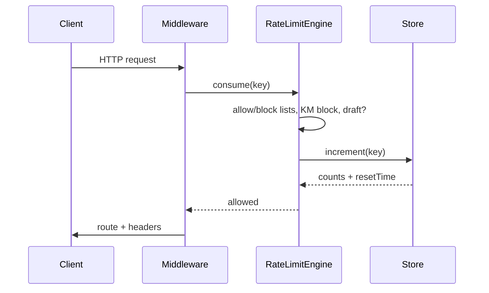
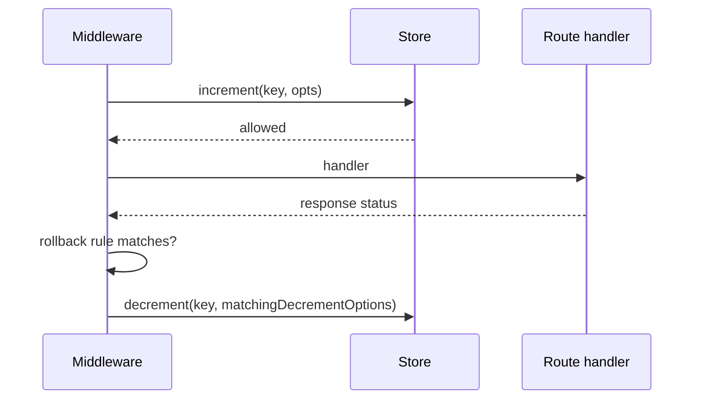
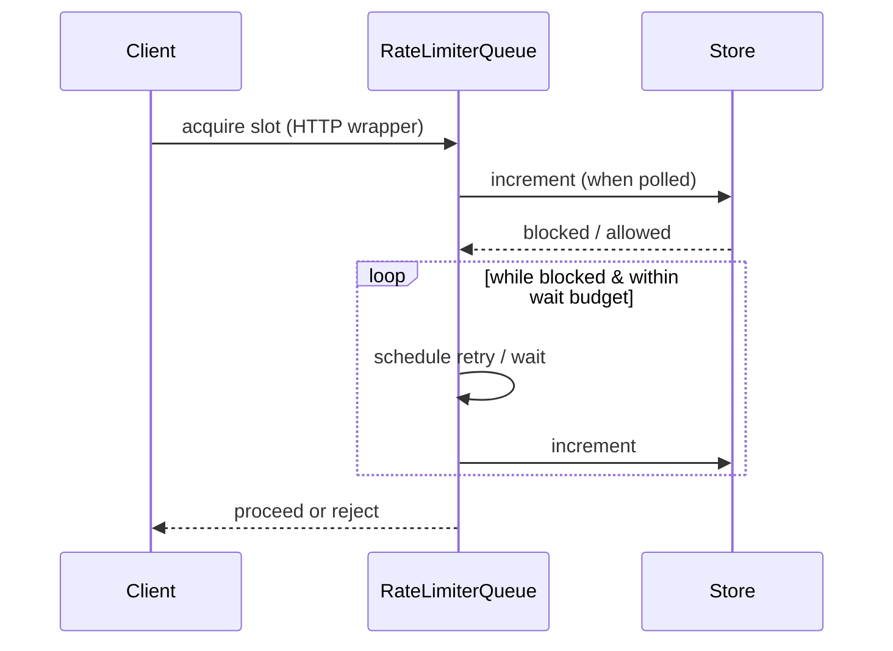
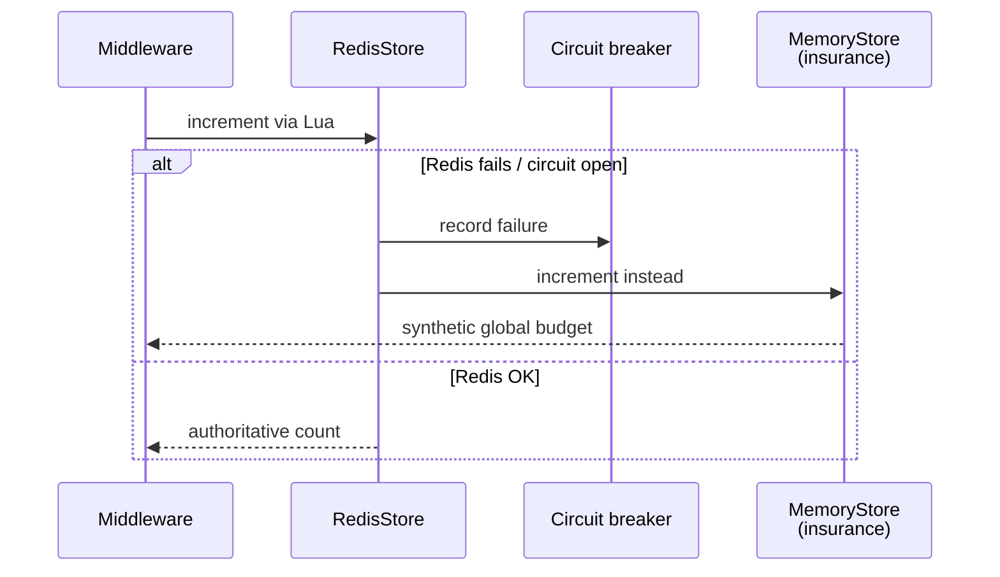

# Operational sequences

Mermaid views of runtime paths. Companion to [FAILURE_MODES.md](FAILURE_MODES.md).

## Standard allow path (HTTP, engine middleware)

## Rollback (`skipSuccessfulRequests` / `skipFailedRequests`)

## Queued inbound request (wake on capacity)

Uses **`store.increment` only** — see [QUEUING.md § Engine parity](QUEUING.md#engine-middleware-vs-queued-middleware-parity).

## Redis resilience: failover to insurance MemoryStore

Counter replay when Redis closes the circuit again is outlined in **[REDIS_RESILIENCE.md](REDIS_RESILIENCE.md)** and `RedisStore` JSDoc (sliding-window timestamp smearing caveat).
