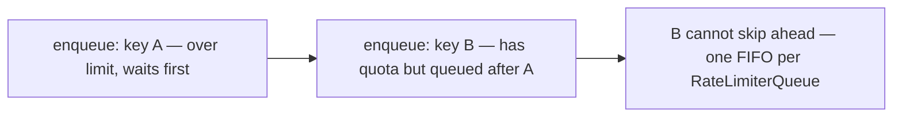

# Request Queuing

Queue over-limit requests instead of rejecting them immediately. Requests wait in a FIFO queue and are released when quota becomes available.

## Table of Contents

- [Overview](#overview)
- [Use Cases](#use-cases)
- [Quick Start](#quick-start)
  - [HTTP Middleware](#http-middleware)
  - [Outbound API Throttling](#outbound-api-throttling)
- [Head-of-Line Blocking](#head-of-line-blocking)
- [Multi-Key Patterns](#multi-key-patterns)
- [Graceful Shutdown](#graceful-shutdown)
- [Store Ownership](#store-ownership)
- [Advanced Patterns](#advanced-patterns)

---

## Overview

**Source of truth:** Full FIFO semantics, head-of-line blocking, and multi-key patterns are documented in JSDoc on [`src/queue/RateLimiterQueue.ts`](../src/queue/RateLimiterQueue.ts) (`RateLimiterQueueOptions`, `RateLimiterQueue`). That file is the canonical explanation; this document summarizes it for users.

**Typical use case:** Outbound API throttling (one queue per external API, single key for all requests).

---

## Use Cases

### Good Use Cases
- **Outbound API rate limiting**: Throttle requests to external APIs (GitHub, Stripe, etc.)
- **Single-key scenarios**: One queue per API endpoint or service
- **Graceful degradation**: Wait instead of failing immediately
- **Background jobs**: Queue tasks that can tolerate delays

### Poor Use Cases
- **High-cardinality keys**: Per-user queues with thousands of users (use `KeyedRateLimiterQueue` instead)
- **Real-time APIs**: User-facing endpoints where latency matters
- **Mixed keys in one queue**: Causes head-of-line blocking (see below)

---

## Quick Start

### HTTP Middleware

**Express:**
```typescript
import { expressQueuedRateLimiter } from 'ratelimit-flex';

app.use('/slow-endpoint', expressQueuedRateLimiter({
  maxRequests: 5,
  windowMs: 10_000,
  maxQueueSize: 50,
  maxQueueTimeMs: 30_000,
}));
// Requests over 5/10s are held and released when quota opens up
```

**Fastify:**
```typescript
import { fastifyQueuedRateLimiter } from 'ratelimit-flex/fastify';

await app.register(fastifyQueuedRateLimiter, {
  maxRequests: 5,
  windowMs: 10_000,
  maxQueueSize: 50,
  maxQueueTimeMs: 30_000,
});
// Requests over 5/10s are held and released when quota opens up
// Fastify plugin automatically calls queue.shutdown() on server close
```

### Outbound API Throttling

**Non-HTTP (programmatic):**
```typescript
import { createRateLimiterQueue } from 'ratelimit-flex';

const githubQueue = createRateLimiterQueue({
  maxRequests: 30,
  windowMs: 60_000,
  maxQueueSize: 200,
});

// In your code — waits instead of rejecting
await githubQueue.removeTokens('github-api');
const response = await fetch('https://api.github.com/repos/...');
```

---

## Head-of-Line Blocking

**By design:** The queue is one **FIFO** array. If you share that queue across **different** keys, a waiting request for key **A** sits in front of a request for key **B** — even when **B** still has rate-limit capacity — because release order follows **enqueue** order, not per-key fairness.



**Solution:** Use one queue per key (see [Multi-Key Patterns](#multi-key-patterns)).

---

## Multi-Key Patterns

### Option 1: KeyedRateLimiterQueue (Recommended)

Use **`KeyedRateLimiterQueue`** for an **LRU-bounded** map of inner queues:

```typescript
import { KeyedRateLimiterQueue } from 'ratelimit-flex';

const keyed = new KeyedRateLimiterQueue({
  maxRequests: 10,
  windowMs: 60_000,
  maxKeys: 2_000, // LRU eviction after 2000 keys
});

await keyed.removeTokens('tenant-a', 'tenant-a');
await keyed.removeTokens('tenant-b', 'tenant-b'); // Independent queue
```

### Option 2: Manual Map Management

```typescript
import { createRateLimiterQueue, type RateLimiterQueue } from 'ratelimit-flex';

// ❌ Bad: single queue with multiple keys causes head-of-line blocking
const sharedQueue = createRateLimiterQueue({ maxRequests: 10, windowMs: 1000 });
await sharedQueue.removeTokens('user:alice'); // Blocks...
await sharedQueue.removeTokens('user:bob');   // ...waits even if bob has capacity

// ✅ Good: separate queue per key
const queues = new Map<string, RateLimiterQueue>();

function getQueue(userId: string) {
  if (!queues.has(userId)) {
    queues.set(userId, createRateLimiterQueue({ 
      maxRequests: 10, 
      windowMs: 1000 
    }));
  }
  return queues.get(userId)!;
}

await getQueue('alice').removeTokens('user:alice'); // Independent
await getQueue('bob').removeTokens('user:bob');     // Independent
```

---

## Graceful Shutdown

### Express

Manually call shutdown on SIGTERM:

```typescript
const limiter = expressQueuedRateLimiter({ 
  maxRequests: 10, 
  windowMs: 60_000 
});

app.use(limiter);

process.on('SIGTERM', async () => {
  limiter.queue.shutdown(); // Rejects all pending requests and closes the store
  await server.close();
});
```

### Fastify

Automatic shutdown via onClose hook:

```typescript
await app.register(fastifyQueuedRateLimiter, {
  maxRequests: 10,
  windowMs: 60_000,
});
// Plugin automatically calls queue.shutdown() when server closes
```

---

## Store Ownership

The queue takes ownership of the backing store. Calling `queue.shutdown()` will close the store via `store.shutdown()`.

**Important:** If you share a store across multiple queues or components, use `queue.clear()` instead of `queue.shutdown()` to avoid closing the shared store prematurely.

```typescript
// Shared store scenario
const sharedStore = new RedisStore({ url: REDIS_URL, ... });

const queue1 = createRateLimiterQueue({ 
  store: sharedStore, 
  maxRequests: 10, 
  windowMs: 60_000 
});

const queue2 = createRateLimiterQueue({ 
  store: sharedStore, 
  maxRequests: 20, 
  windowMs: 60_000 
});

// ❌ Bad: closes shared store
await queue1.shutdown();

// ✅ Good: clears queue without closing shared store
await queue1.clear();
await queue2.clear();
await sharedStore.shutdown(); // Close store separately
```

---

## Advanced Patterns

### Per-Tenant Queuing

```typescript
import { KeyedRateLimiterQueue } from 'ratelimit-flex';

const tenantQueues = new KeyedRateLimiterQueue({
  maxRequests: 100,
  windowMs: 60_000,
  maxKeys: 1000,
  maxQueueSize: 50,
  maxQueueTimeMs: 30_000,
});

// Each tenant gets independent queue
await tenantQueues.removeTokens('tenant-123', 'tenant-123');
await tenantQueues.removeTokens('tenant-456', 'tenant-456');
```

### Priority Queuing (Custom)

```typescript
// High-priority queue
const highPriorityQueue = createRateLimiterQueue({
  maxRequests: 20,
  windowMs: 60_000,
  maxQueueSize: 100,
});

// Low-priority queue
const lowPriorityQueue = createRateLimiterQueue({
  maxRequests: 5,
  windowMs: 60_000,
  maxQueueSize: 50,
});

// Route to appropriate queue based on priority
async function rateLimitedFetch(url: string, priority: 'high' | 'low') {
  const queue = priority === 'high' ? highPriorityQueue : lowPriorityQueue;
  await queue.removeTokens('api');
  return fetch(url);
}
```

### Outbound API with Retry

```typescript
import { createRateLimiterQueue } from 'ratelimit-flex';

const apiQueue = createRateLimiterQueue({
  maxRequests: 30,
  windowMs: 60_000,
  maxQueueSize: 200,
  maxQueueTimeMs: 30_000,
});

async function callExternalAPI(endpoint: string, retries = 3) {
  for (let i = 0; i < retries; i++) {
    try {
      await apiQueue.removeTokens('external-api');
      const response = await fetch(endpoint);
      
      if (response.ok) return response;
      
      // If rate limited by external API, wait and retry
      if (response.status === 429) {
        const retryAfter = response.headers.get('Retry-After');
        await new Promise(resolve => 
          setTimeout(resolve, (parseInt(retryAfter || '1') * 1000))
        );
        continue;
      }
      
      throw new Error(`API error: ${response.status}`);
    } catch (error) {
      if (i === retries - 1) throw error;
    }
  }
}
```

### Queue Metrics

```typescript
const queue = createRateLimiterQueue({
  maxRequests: 10,
  windowMs: 60_000,
  maxQueueSize: 50,
});

// Monitor queue health
setInterval(() => {
  const metrics = {
    queueSize: queue.queueSize,
    isProcessing: queue.isProcessing,
    // Add custom metrics as needed
  };
  
  console.log('Queue metrics:', metrics);
  
  if (metrics.queueSize > 40) {
    console.warn('Queue is nearly full!');
  }
}, 10_000);
```

---

## Configuration Options

| Option | Type | Default | Description |
|--------|------|---------|-------------|
| `maxRequests` | `number` | — | Maximum requests per window |
| `windowMs` | `number` | — | Time window in milliseconds |
| `maxQueueSize` | `number` | `100` | Maximum queued requests |
| `maxQueueTimeMs` | `number` | `30000` | Maximum wait time (ms) |
| `store` | `RateLimitStore` | auto `MemoryStore` | Backing store |
| `strategy` | `RateLimitStrategy` | `SLIDING_WINDOW` | Rate limiting algorithm |

---

## See Also

- [Main README](../README.md#request-queuing) - Quick overview
- [Limiter Composition](./COMPOSITION.md) - Combine multiple limiters
- [Deployment Guide](../README.md#deployment-guide) - Production patterns
- [Source Code](../src/queue/RateLimiterQueue.ts) - Full implementation details
